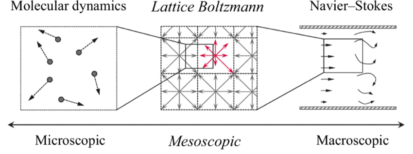

# Lattice-Boltzmann-Simulation

Thank you for an article from Philip Mocz , (https://medium.com/@philip-mocz) if you want to study coding about physics which you can choice to study from blog of him. 

(refer image : https://www.researchgate.net/publication/332077856_Multiscale_Simulation_of_Elongated_Particles_in_Fluidised_Beds)
