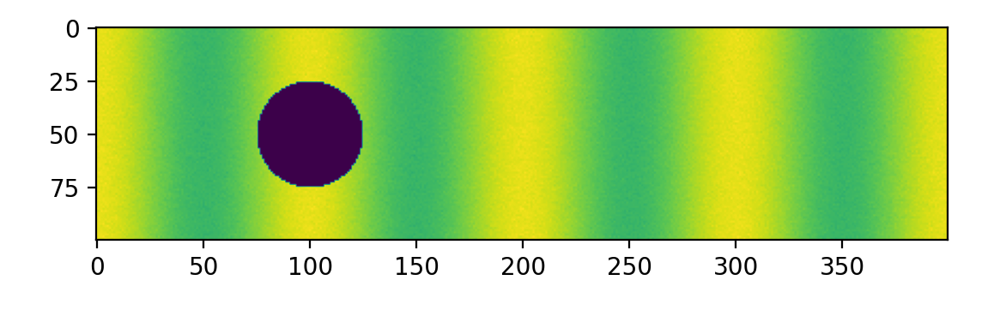
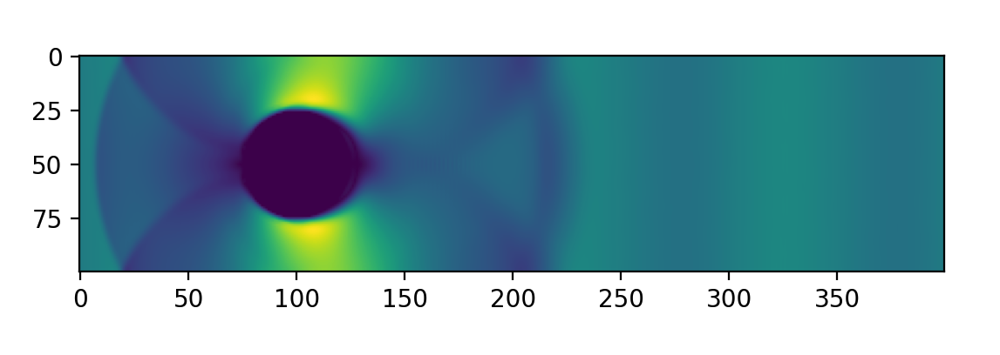
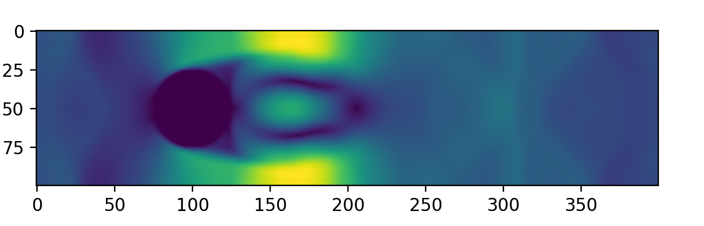
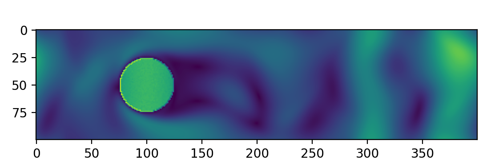
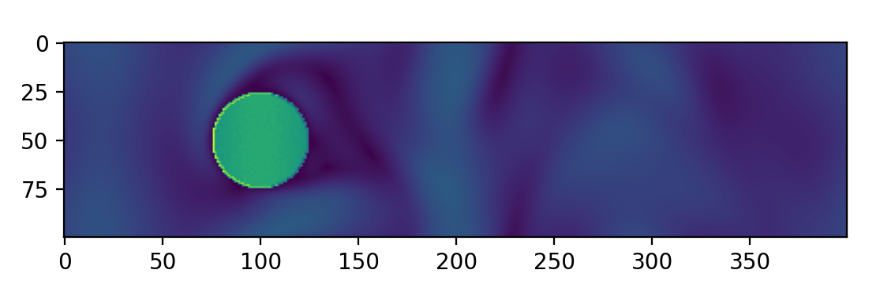
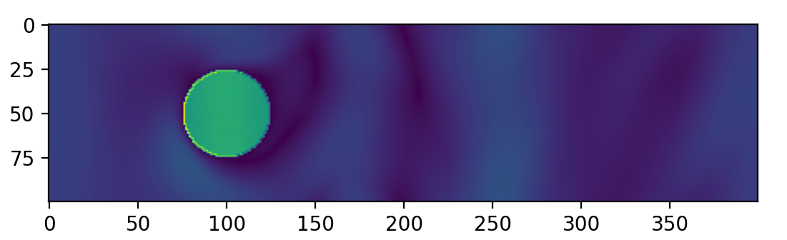
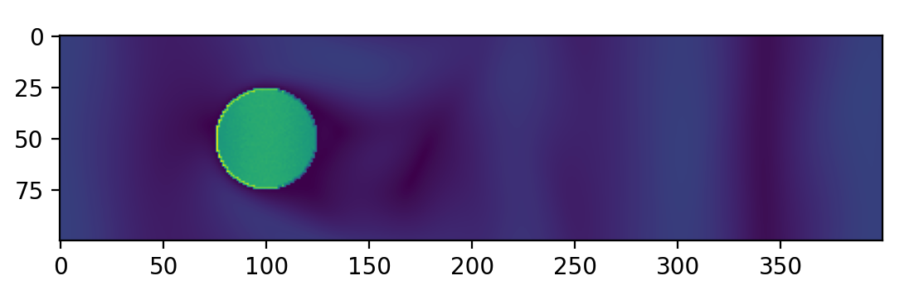

# Thank for accomplish of Lattice-Boltzmann-Simulation

Thank you for an article from Philip Mocz , (https://medium.com/@philip-mocz) if you want to study coding about physics which you can choice to study from blog of him. 

###### (refer image : https://www.researchgate.net/publication/332077856_Multiscale_Simulation_of_Elongated_Particles_in_Fluidised_Beds)

# Result in Lattice Boltzmann method
  

###### Number of variable Nt: 1 (Old Version)

###### Number of variable Nt: 10 (Old Version)

###### Number of variable Nt: 1000 (Old Version)

###### Number of variable Nt: 5000 (Old Version)

###### Number of variable Nt: 10 000 (Standard)

###### Number of variable Nt: 12 000 (Standard)

###### Number of variable Nt: 15 000 (Standard)

# Update now
-  -31/10/22- I fixed the generator image to the frame's image ,which look like vdieo frame by frame

# Bug and Problems 
- __ [31/10/22] __ I think my coding is a problem due to this using more time to calculate and plot,which might mean the algorithm is not best to use
